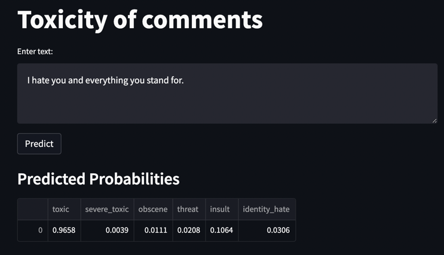

# Toxic Comment Classifier

This project provides a solution for classifying toxic comments using a BERT-based model. The model can predict six types of toxicity in a comment: **toxic, severe_toxic, obscene, threat, insult, identity_hate**.

## Installation

To get started with the project, follow these steps:

1. Clone the repository:

   ```bash
   git clone https://github.com/InnaK342/toxic-comment-classifier-bert.git
   cd toxic-comment-classifier-bert
  
2. Create a virtual environment and activate it (optional but recommended):

    ```bash
    python3 -m venv venv
    source venv/bin/activate  # On Windows, use venv\Scripts\activate

3. Install the required dependencies:

    ```bash
    pip install -r requirements.txt

## Training and Testing the Model

1.  The training and testing process is documented in the [Colab Notebook](colab/Detecting_toxic_content.ipynb). This notebook contains:
    
    *   **Data preprocessing**: Cleaning and preparing the toxic comment dataset.
    *   **Model training**: Training the BERT-based model to classify toxic comments.
    *   **Model evaluation**: Testing the model and evaluating its performance on a test dataset.
    
2.  Once the model is trained, it is saved to the Hugging Face model hub for easy access. The model can be loaded using the `transformers` library.
    - The model and tokenizer are loaded in the app with the following code:

    ```python
    model = BertForSequenceClassification.from_pretrained('InnaK342/bert-toxic-comment')
    tokenizer = BertTokenizer.from_pretrained('InnaK342/bert-toxic-comment')
    ```
    
## Running the Streamlit App

To run the Streamlit app that classifies toxicity in user comments, follow these steps:

1. Make sure your virtual environment is activated and dependencies are installed.

2. Run the Streamlit app:

   ```bash
   streamlit run app.py

3. This will launch a local Streamlit interface where you can input text, and the app will predict the toxicity of the comment. The output will show the prediction for each type of toxicity.

## Model Storage

- The model is stored on [Hugging Face](https://huggingface.co/) under the following name: `InnaK342/bert-toxic-comment`.
- You can access the model directly from Hugging Face and use it for inference as demonstrated in the app.

## Example Output

Below is an example of the test result from the Streamlit app:



## File Description

- **colab/Detecting_toxic_content.ipynb**: Jupyter notebook for training and evaluating the toxicity detection model.
- **images/interface.png**: Screenshot of the Streamlit interface.
- **images/test_result.png**: Example output from the Streamlit app.
- **app.py**: The main Streamlit app file that allows you to classify toxic comments.
- **requirements.txt**: Contains the list of Python packages required to run the project.
- **README.md**: This file.
